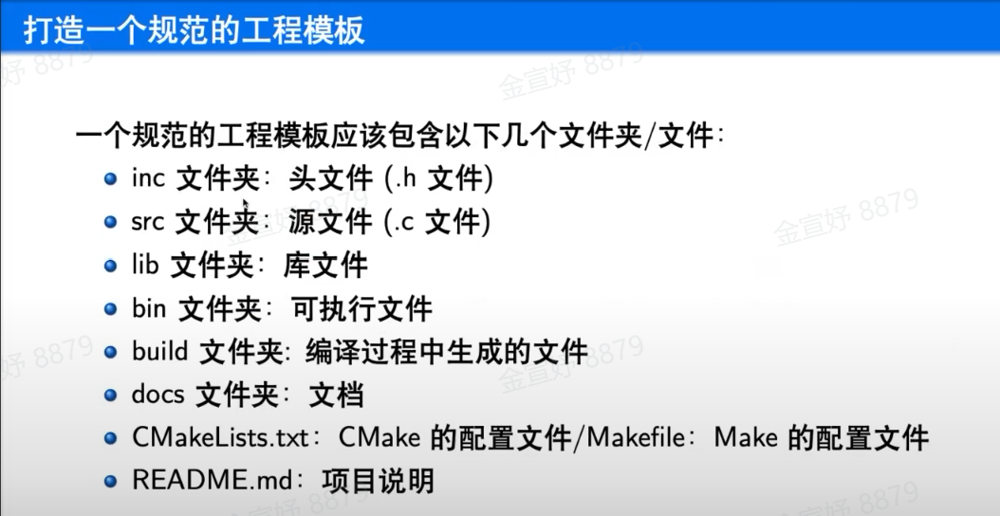
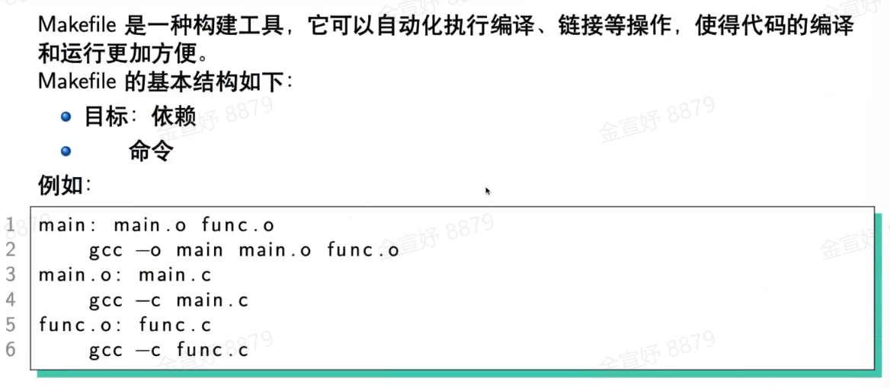
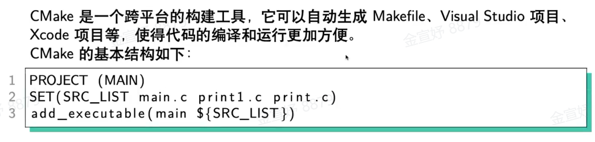
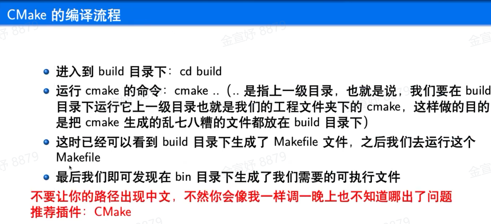

# xlab内训 宝盖版

- ### about github-desktop：

  - clone: file-clone
  - 保存修改：commit to main(到master) + fetch origin 
    - commit to main处的summary会变成github网页上的注释。还是要好好写以清晰明了的表达。
  - 在vscode编辑时，`.c` 文件旁边的 **M** 代表 **Modified**（已修改）。这表示该文件自上次 Git 提交（commit）后已经被更改，但还没有被提交到本地仓库。

- ### about 项目链

  - 

  - `.h`文件规范(xx.h)

    ```c
    #ifndef _XX_H_
    #define _XX_H_
    ...
    #endif
    ```

  - about Makefile:

    

  - about CMakeLists.txt:

    	写完cmakelists.txt, 在终端输入`cmake .` （或`cmake --build .`?) 有空格！！能通过vscode左下角的“生成”键来生成最好。


- ### about ESP32

  - 当做正常的单片机就好啦。
  - vscode上先`biuld`（√）再`upload`（→）。
  - 一个小小点：`upload`若显示`A fatal error occurred: Could not open COM10, the port doesn't exist`，可能串口被占用，这时候检查是不是打开了串口调试助手没有关。要看隐藏的图标有没有彻底关。